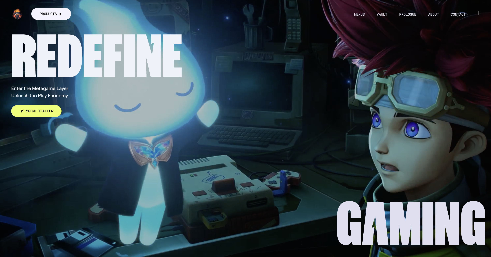

<div align="center">
  <br />
    <a href="live-project-link" target="_blank">
      
    </a>
  <br />

  <div>
    
    
    
  </div>

  <h3 align="center">Zentry Gaming Website</h3>

</div>

## 📋 <a name="table">Table of Contents</a>

1. 🤖 [Introduction](#introduction)
2. ⚙️ [Tech Stack](#tech-stack)
3. 🔋 [Features](#features)
4. 🤸 [Quick Start](#quick-start)
5. 🕸️ [Snippets (Code to Copy)](#snippets)
6. 🔗 [Assets](#links)
7. 🚀 [More](#more)

## ⚠️ Disclaimer

All design credits go to **[Zentry](https://zentry.com/)**. This project is created purely for **educational purposes** and is not intended for commercial use or public deployment.

> This project uses some assets and fonts from **[Zentry](https://zentry.com/)** purely for educational and demonstration purposes. All rights to these assets and fonts belong to their respective owners. If you plan to use this project commercially or publicly, please replace these assets and fonts with ones you own or have permission to use. This project is not affiliated with or endorsed by **[Zentry](https://zentry.com/)**.

## <a name="introduction">🤖 Introduction</a>

This is a visually captivating website inspired by **[Zentry](https://zentry.com/)**, featuring scroll-triggered animations, geometric transitions, and engaging video storytelling. It showcases a luxurious, modern feel, focusing on engaging UI/UX and smooth responsiveness.

## <a name="tech-stack">⚙️ Tech Stack</a>

- GSAP
- React.js
- Tailwind CSS

## <a name="features">🔋 Features</a>

👉 **Scroll-Based Animations**: Dynamic animations triggered by scrolling for a more engaging user experience.

👉 **Clip Path Shaped Animations**: Unique geometric transitions using CSS clip-paths to create visually stunning effects.

👉 **3D Hover Effects**: Interactive 3D transformations that respond to user interactions for a modern feel.

👉 **Video Transitions**: Seamlessly integrated video elements to enhance storytelling and flow.

👉 **Smooth UI/UX**: Polished interfaces with buttery-smooth interactions for an intuitive user journey.

👉 **Completely Responsive**: Flawless adaptation across all devices, ensuring a consistent experience.

and many more, including code architecture and reusability

## <a name="quick-start">🤸 Quick Start</a>

Follow these steps to set up the project locally on your machine.

**Prerequisites**

Make sure you have the following installed on your machine:

- [Git](https://git-scm.com/)
- [Node.js](https://nodejs.org/en)
- [npm](https://www.npmjs.com/) (Node Package Manager)

**Cloning the Repository**

```bash
git clone https://github.com/shahriar-tamjid/zentry-gaming.git
cd zentry-gaming
```

**Installation**

Install the project dependencies using npm:

```bash
npm install
```

**Running the Project**

```bash
npm run dev
```

Open [http://localhost:5173](http://localhost:5173) in your browser to view the project.

